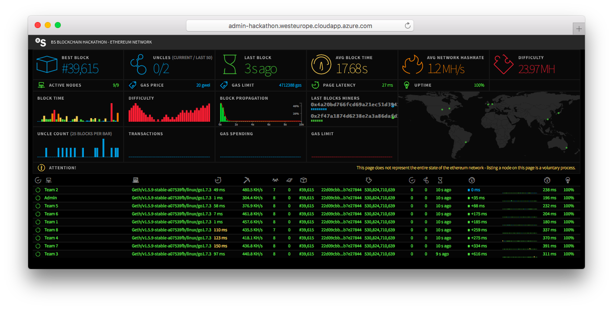

#Welcome to the Banc Sabadell Blockchain Hackathon

This is your team's base repository for the BS Hackathon, please clone it and upload all code and project resources here.

##Our Ethereum network

In order to ease development during the event we've configured a private Ethereum network, this network is shared by all the teams and composed of several Linux virtual machines, each running a dedicated Ethereum node ([`geth`](https://github.com/ethereum/go-ethereum/wiki/geth)). Each team has access to its own unique VM:


To get a better idea of the network and its behavior you can have a look at the different network stats using our monitoring [tool](http://admin-hackathon.westeurope.cloudapp.azure.com:3000/):



###Access to your Ethereum node

Connecting to your `geth` instance through **JSON-RPC**:

* host: `[pending]`
* port: `8545`

In case your project depends on additional software (e.g. Node) you have full access to the machine via **SSH**:

* host: `[pending]`
* user: `[pending]`
* pasword: `[pending]`

##BSToken contract


BSToken is a [digital token](https://www.ethereum.org/token) created exclusively by Banc Sabadell for this hackathon, you can integrate your Ethereum contracts with this token to create a variety of applications based on _tradable goods_ (E.g. [debt](https://forum.ethereum.org/discussion/2989/decentralized-system-for-securitizing-collateral-debt-obligations-using-the-ethereum-blockchain), [watts](http://www.coindesk.com/ethereum-used-first-paid-energy-trade-using-blockchain-technology/), etc. See [bs-scrow](https://github.com/BancoSabadell/bs-escrow) below for an example).

BSToken is implemented with a set of Solidity contracts that follow the [ERC20](https://github.com/ethereum/EIPs/issues/20) token specification:

```
// Abstract contract for the full ERC 20 Token standard
// https://github.com/ethereum/EIPs/issues/20
pragma solidity ^0.4.6;

contract Token {
    function totalSupply() constant returns (uint256);
    function balanceOf(address _owner) constant returns (uint256 balance);
    function transfer(address _to, uint256 _value) returns (bool success);
    function transferFrom(address _from, address _to, uint256 _value) returns (bool success);
    function approve(address _spender, uint256 _value) returns (bool success);
    function allowance(address _owner, address _spender) constant returns (uint256 remaining);

    event Transfer(address indexed _from, address indexed _to, uint256 _value);
    event Approval(address indexed _owner, address indexed _spender, uint256 _value);
}
```

<details>
<summary>And its corresponding ABI (click to expand)</summary>
```javascript
[
	{
		"constant": false,
		"inputs": [
			{
				"name": "spender",
				"type": "address"
			},
			{
				"name": "value",
				"type": "uint256"
			}
		],
		"name": "approve",
		"outputs": [
			{
				"name": "success",
				"type": "bool"
			}
		],
		"payable": false,
		"type": "function"
	},
	{
		"constant": false,
		"inputs": [

		],
		"name": "startEmergency",
		"outputs": [

		],
		"payable": false,
		"type": "function"
	},
	{
		"constant": true,
		"inputs": [

		],
		"name": "totalSupply",
		"outputs": [
			{
				"name": "",
				"type": "uint256"
			}
		],
		"payable": false,
		"type": "function"
	},
	{
		"constant": false,
		"inputs": [
			{
				"name": "from",
				"type": "address"
			},
			{
				"name": "to",
				"type": "address"
			},
			{
				"name": "value",
				"type": "uint256"
			}
		],
		"name": "transferFrom",
		"outputs": [
			{
				"name": "success",
				"type": "bool"
			}
		],
		"payable": false,
		"type": "function"
	},
	{
		"constant": true,
		"inputs": [

		],
		"name": "bsToken",
		"outputs": [
			{
				"name": "",
				"type": "address"
			}
		],
		"payable": false,
		"type": "function"
	},
	{
		"constant": true,
		"inputs": [
			{
				"name": "account",
				"type": "address"
			}
		],
		"name": "balanceOf",
		"outputs": [
			{
				"name": "",
				"type": "uint256"
			}
		],
		"payable": false,
		"type": "function"
	},
	{
		"constant": false,
		"inputs": [

		],
		"name": "stopEmergency",
		"outputs": [

		],
		"payable": false,
		"type": "function"
	},
	{
		"constant": true,
		"inputs": [

		],
		"name": "merchant",
		"outputs": [
			{
				"name": "",
				"type": "address"
			}
		],
		"payable": false,
		"type": "function"
	},
	{
		"constant": false,
		"inputs": [
			{
				"name": "to",
				"type": "address"
			},
			{
				"name": "value",
				"type": "uint256"
			}
		],
		"name": "transfer",
		"outputs": [
			{
				"name": "success",
				"type": "bool"
			}
		],
		"payable": false,
		"type": "function"
	},
	{
		"constant": true,
		"inputs": [
			{
				"name": "account",
				"type": "address"
			}
		],
		"name": "frozenAccount",
		"outputs": [
			{
				"name": "",
				"type": "bool"
			}
		],
		"payable": false,
		"type": "function"
	},
	{
		"constant": false,
		"inputs": [
			{
				"name": "spender",
				"type": "address"
			},
			{
				"name": "to",
				"type": "address"
			},
			{
				"name": "id",
				"type": "string"
			},
			{
				"name": "value",
				"type": "uint256"
			}
		],
		"name": "approveAndCall",
		"outputs": [

		],
		"payable": false,
		"type": "function"
	},
	{
		"constant": true,
		"inputs": [

		],
		"name": "emergency",
		"outputs": [
			{
				"name": "",
				"type": "bool"
			}
		],
		"payable": false,
		"type": "function"
	},
	{
		"constant": false,
		"inputs": [
			{
				"name": "version",
				"type": "address"
			}
		],
		"name": "setBSToken",
		"outputs": [

		],
		"payable": false,
		"type": "function"
	},
	{
		"constant": true,
		"inputs": [
			{
				"name": "account",
				"type": "address"
			},
			{
				"name": "spender",
				"type": "address"
			}
		],
		"name": "allowance",
		"outputs": [
			{
				"name": "",
				"type": "uint256"
			}
		],
		"payable": false,
		"type": "function"
	},
	{
		"constant": false,
		"inputs": [
			{
				"name": "target",
				"type": "address"
			},
			{
				"name": "freeze",
				"type": "bool"
			}
		],
		"name": "freezeAccount",
		"outputs": [

		],
		"payable": false,
		"type": "function"
	},
	{
		"inputs": [
			{
				"name": "theMerchant",
				"type": "address"
			},
			{
				"name": "permissionManagerAddress",
				"type": "address"
			}
		],
		"payable": false,
		"type": "constructor"
	},
	{
		"anonymous": false,
		"inputs": [
			{
				"indexed": true,
				"name": "receiver",
				"type": "address"
			},
			{
				"indexed": false,
				"name": "amount",
				"type": "uint256"
			},
			{
				"indexed": false,
				"name": "bankAccount",
				"type": "string"
			}
		],
		"name": "CashOut",
		"type": "event"
	},
	{
		"anonymous": false,
		"inputs": [
			{
				"indexed": true,
				"name": "_from",
				"type": "address"
			},
			{
				"indexed": true,
				"name": "_to",
				"type": "address"
			},
			{
				"indexed": false,
				"name": "_value",
				"type": "uint256"
			}
		],
		"name": "Transfer",
		"type": "event"
	},
	{
		"anonymous": false,
		"inputs": [
			{
				"indexed": true,
				"name": "_owner",
				"type": "address"
			},
			{
				"indexed": true,
				"name": "_spender",
				"type": "address"
			},
			{
				"indexed": false,
				"name": "_value",
				"type": "uint256"
			}
		],
		"name": "Approval",
		"type": "event"
	}
]
```
</details>

The full contract(s) source code can be found [here](https://github.com/BancoSabadell/bs-token), including an utility JavaScript library, you may consider using it, instead of using directly the contract instance. This abstraction layer provides (among other benefits) some internal checks which prevents executing transactions when they are going to be rejected, loosing that way ether for nothing.

###Contract address

The BS Token contract is deployed at address: **`0x6c8f2a135f6ed072de4503bd7c4999a1a17f824b`**

###Accounts per team (with a 1.000 token/ether balance)

account | password
---	 | ---
0x6c8f2a135f6ed072de4503bd7c4999a1a17f824b | 111111
0x6c8f2a135f6ed072de4503bd7c4999a1a17f824b | 222222
0x6c8f2a135f6ed072de4503bd7c4999a1a17f824b | 333333
0x6c8f2a135f6ed072de4503bd7c4999a1a17f824b | 444444
0x6c8f2a135f6ed072de4503bd7c4999a1a17f824b | 555555

###Sample integration (Escrow contract)

* [bs-escrow: Escrow contract and JavaScript library](https://github.com/BancoSabadell/bs-escrow)
* [bs-escrow-android-sdk: Android SDK and sample App](https://github.com/BancoSabadell/bs-escrow-android-sdk)

###Add tokens to an account using a credit card (Banking API)

If you want to add more tokens to an account or plan to accept payments in exchange of tokens we provide a simple REST API to add tokens to an account using a (test) credit card.


The API is located at: `http://admin-hackathon.westeurope.cloudapp.azure.com`, including de following endpoints:

**Add tokens to an account**

	GET /bs_banking/api/v1/cashIn
	
This call will return an HTML page that will inmediately redirect to the credit card payment form.

Parameters:

name | description
---	 | ---
account | Ethereum address
amount | token amount _(1 BST == 1/100 EUR)_

Example ([View in browser](http://admin-hackathon.westeurope.cloudapp.azure.com/bs_banking/api/v1/cashIn?amount=120&account=0x6c8f2a135f6ed072de4503bd7c4999a1a17f824b)):

	http://admin-hackathon.westeurope.cloudapp.azure.com/bs_banking/api/v1/cashIn?amount=120&account=0x6c8f2a135f6ed072de4503bd7c4999a1a17f824b

Test credit card:

* Number: `4548 8120 4940 0004`
* Expiry date: `12/20`
* Security code: `123`
* CIP: `123456`

##FAQ's
* **Must our project rely on the token contract?** No, we provide the token and escrow contracts as an starting point or a base for *inspiration*.

##Resources

* [Ethereum JavaScript API](https://github.com/ethereum/wiki/wiki/JavaScript-API)
* [web3.js](https://github.com/ethereum/web3.js/)
* [Solidity](http://solidity.readthedocs.io/en/develop/)
* [ERC: Token standard](https://github.com/ethereum/EIPs/issues/20)

##Contact

Need help? Contact us at: [innodev@bancsabadell.com](mailto:innodev@bancsabadell.com)


